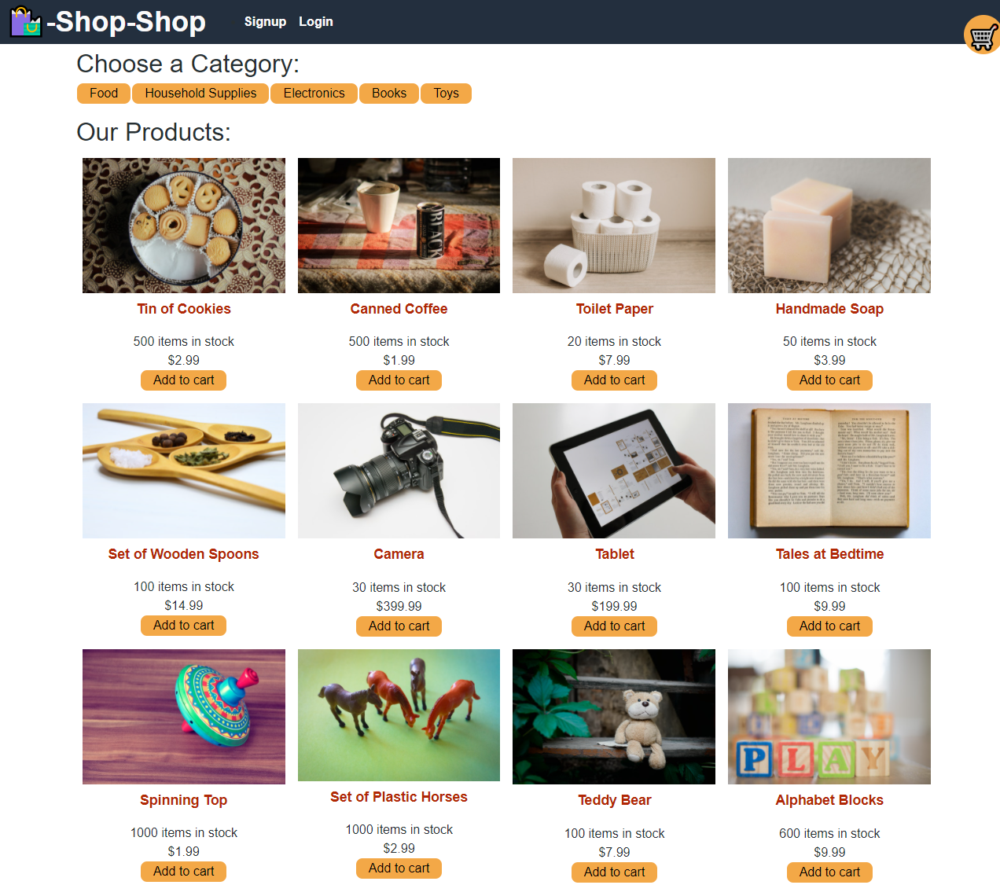

# Shopping Website

  ## Description
  This project modified an existing app to utilize Redux in the react portion of the app to change the various state's of the website.

  ## Github link
  <https://github.com/alexelliott22/shop-shop>

## Deployed Link
<https://shop-shop-2222.herokuapp.com/>

  ## Installation

  To install the necessary dependencies run the following command from the root of the directory:
  npm install

## Homepage

## Sign-up

## Login

  ## Questions 
  If you have any questions about the repo, open an issue, or contact me directly at <alexelliott22@gmail.com>. You can find more of my work at <https://github.com/alexelliott22>.